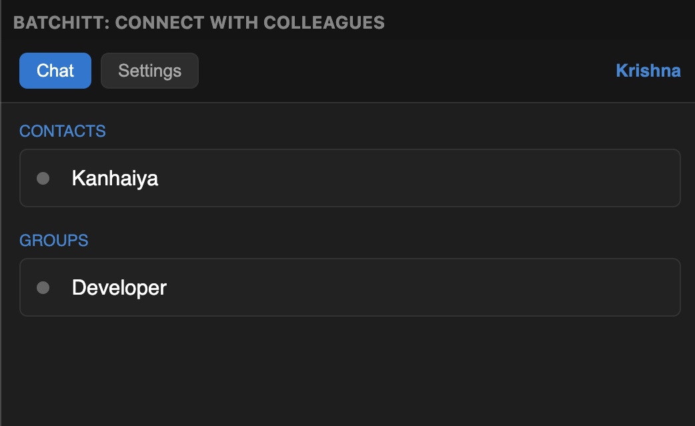
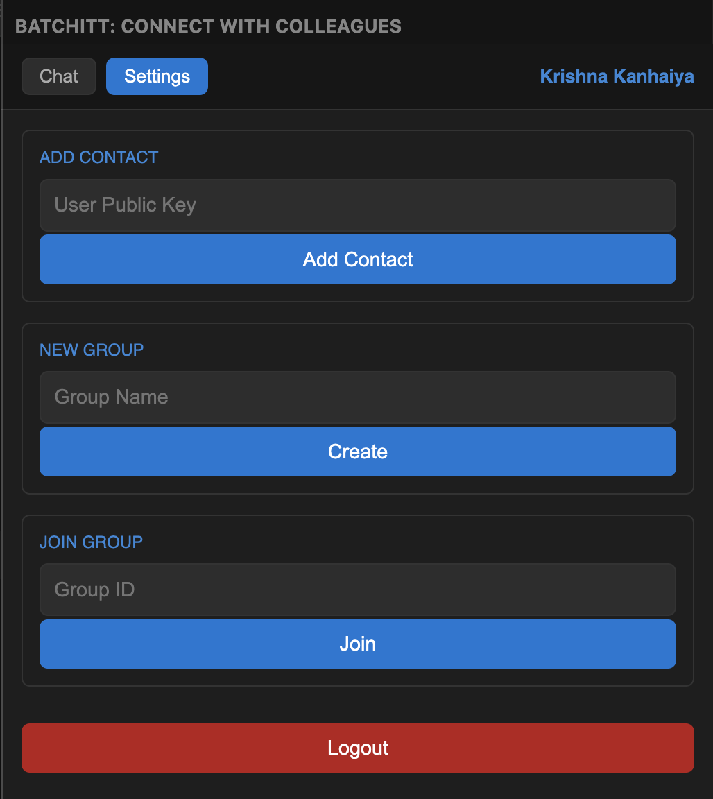

# 🚀 Batchitt: Connect with Colleagues

---

## 📌 Overview

**Batchitt** is a powerful VS Code extension that enables real-time communication between developers directly inside the editor.

Chat one-to-one or in groups without leaving your coding environment 🚀

---

## ✨ Features

- 💬 One-to-one chat with colleagues
- 👥 Group chat support
- ⚡ Lightweight and fast integration inside VS Code
- 🔗 Seamless collaboration within your workspace
- 🔐 Secure authentication using auth key
- 👨‍💻 Developer-friendly UI

---

## 🔐 Authentication Process

To use Batchitt, follow these steps:

1. Visit 👉 https://batchitt.com  
2. Login to your account  
3. Copy your **Auth Key** from dashboard  
4. Open VS Code  
5. Paste the Auth Key inside the Batchitt extension  
6. You will be logged in successfully ✅  

---

## 🛠️ Installation

### From VS Code Marketplace
1. Open VS Code
2. Go to Extensions (`Ctrl + Shift + X`)
3. Search for **Batchitt**
4. Click **Install**

---

### Chat UI

### Setting UI

